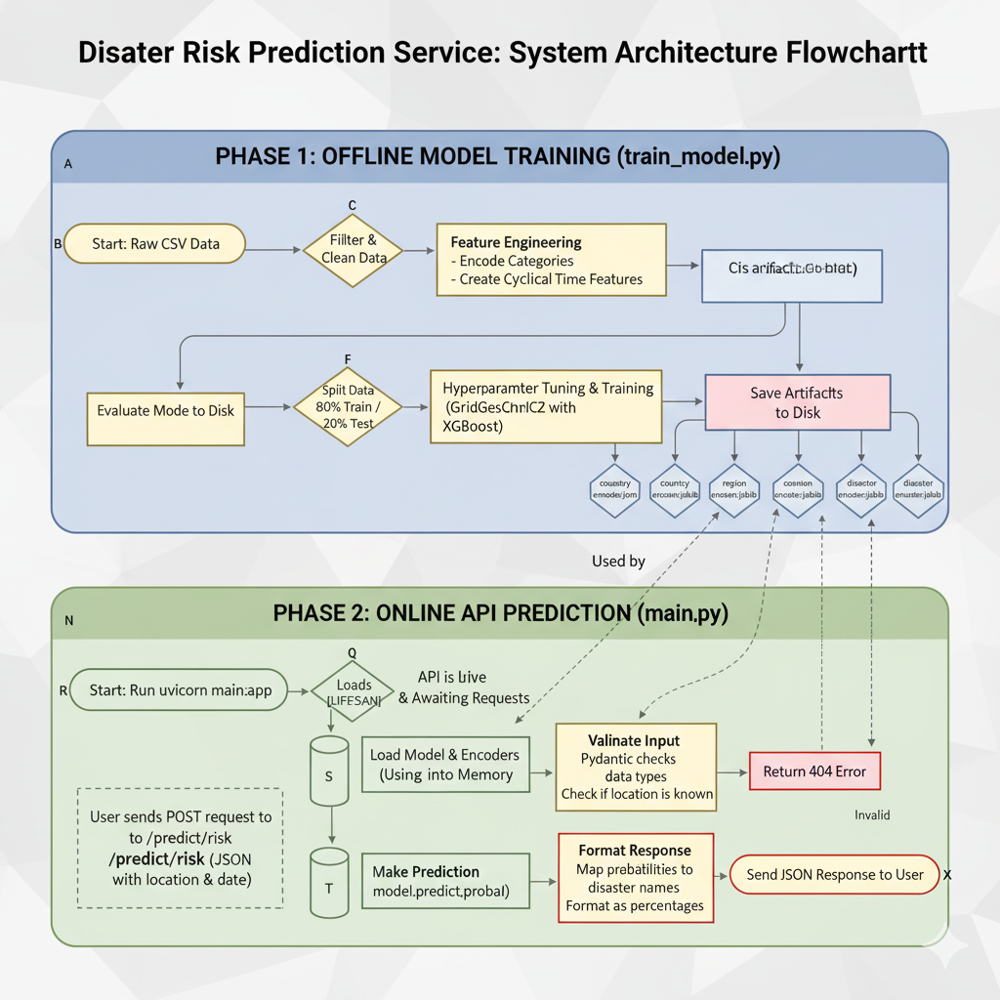

# 🌍 Truly Predictive Natural Disaster API 🌩️


This project provides a RESTful API to predict the probability of specific natural disasters (Flood, Storm, Landslide, Wildfire) occurring at a given location and time. It uses a machine learning model trained on historical disaster data from 1970 to 2021.

## Table of Contents
- 📍 Overview
- 🎒 A Traveller's Use Case
- ⚙️ How It Works
  - 🧠 1. Model Training (`train_model.py`)
  - 🖥️ 2. API Service (`main.py`)
- 🤖 The Machine Learning Model: XGBoost
- 📁 Project Structure
- 🛠️ Setup and Usage
  - ✅ Prerequisites
  - 📦 Installation
  - 🚀 Running the Application
  - 👉 Making a Prediction
- 🌐 Example API Interaction

## 📍 Overview

The goal of this project is to provide a simple yet powerful tool for estimating disaster risk. By sending a location (Country, Region, Continent) and a date (Year, Month, Day) to the API, you receive a breakdown of probabilities for four major disaster types.

This is achieved by:
1.  Training an **XGBoost** classifier on a historical dataset of natural disasters.
2.  Serving this trained model via a **FastAPI** web server.

## 🎒 A Traveller's Use Case

Imagine you are a traveller planning a trip. How can this API help you?

> Let's say you want to visit Bangladesh in August 2025. Before booking your flights and accommodation, you can use this API to assess the potential risks. By sending a request with the country, region, continent, and date, you might receive a response indicating a high probability of 'Flood' and 'Storm' for that time of year, which corresponds to the monsoon season.

This valuable insight allows you to:

-   **📅 Plan Safer Trips**: You might decide to shift your travel dates to a drier season to avoid potential disruptions.
-   **🗺️ Choose Destinations Wisely**: If your dates are fixed, you could use the API to compare the risk profiles of different potential destinations.
-   **☔ Be Better Prepared**: If you decide to travel anyway, you'll know to pack waterproof gear, monitor local weather advisories closely, and perhaps purchase more comprehensive travel insurance.

By turning historical data into an actionable forecast, this tool empowers travellers to make more informed and safer decisions.

## ⚙️ How It Works

The project is split into two main components: the model training script and the API service.

This graph illustrates the complete workflow, from initial model training to a live API prediction.




### 🧠 1. Model Training (`train_model.py`)

This script is responsible for preparing the data and training the machine learning model.

**Key Steps:**

1.  **📂 Load Data**: It loads the `1970-2021_DISASTERS.xlsx - emdat data.csv` dataset.
2.  **🧹 Filter & Clean**: The dataset is filtered to keep only the disaster types we want to predict: `Flood`, `Storm`, `Landslide`, and `Wildfire`. Any rows with missing data in key columns are dropped.
3.  **✨ Feature Engineering**: This is a critical step where raw data is transformed into features suitable for the model.
    *   **Categorical Encoding**: Text-based columns like `Country`, `Region`, and `Continent` are converted into numerical values using `sklearn.preprocessing.LabelEncoder`. The model can only work with numbers.
    *   **Cyclical Time Features**: Months and days are cyclical (e.g., day 31 is close to day 1, December is close to January). To represent this relationship, they are transformed using sine and cosine functions (`month_sin`, `month_cos`, `day_sin`, `day_cos`). This helps the model understand the cyclical nature of seasons and dates.
4.  **🏋️ Model Training**:
    *   An **XGBoost Classifier** (`XGBClassifier`) is chosen for the task.
    *   **Hyperparameter Tuning**: `GridSearchCV` is used to systematically test different combinations of model parameters (like `n_estimators`, `max_depth`) to find the configuration that yields the highest accuracy. This ensures the model is as performant as possible.
5.  **📊 Evaluation**: The model's performance is measured on a separate test dataset (20% of the original data) that it has never seen before. This gives an "honest" accuracy score.
6.  **💾 Save Artifacts**: The final trained model (`disaster_model.json`) and the label encoders (`*.joblib` files) are saved to disk. These are the "brains" that the API will use.

### 🖥️ 2. API Service (`main.py`)

This script uses the **FastAPI** framework to create a web server that exposes our trained model to the world.

**Key Steps:**

1.  **⏳ Lifespan Management**: Using a `lifespan` function, the script loads the `disaster_model.json` and all the `.joblib` encoders into memory *once* when the API starts up. This is highly efficient as it avoids reloading these files for every single prediction request.
2.  **📝 Input Modeling**: A Pydantic `PredictionInput` model defines the exact structure and data types the API expects for a request (e.g., `year` must be an integer, `month` must be between 1 and 12). This provides automatic data validation.
3.  **🎯 Prediction Endpoint (`/predict/risk`)**: This is the main API endpoint.
    *   It accepts a `POST` request with a JSON body matching the `PredictionInput` model.
    *   **Validation**: It first checks if the input `country`, `region`, and `continent` are known to the model (i.e., they were present in the training data). If not, it returns a helpful `404 Not Found` error.
    *   **Feature Engineering**: It performs the **exact same** feature engineering steps as the training script (label encoding, cyclical transformations) on the incoming data. This consistency is crucial for accurate predictions.
    *   **Prediction**: The processed input data is fed to the loaded XGBoost model, which returns an array of probabilities for each disaster type.
    *   **Format Response**: The raw probabilities are mapped back to their corresponding disaster names (e.g., `[0.15, 0.60, 0.05, 0.20]` -> `{"Flood": "15.00%", "Storm": "60.00%", ...}`). This formatted JSON is then sent back to the user.

## 🤖 The Machine Learning Model: XGBoost

We use **XGBoost (Extreme Gradient Boosting)**, a powerful and popular machine learning algorithm.

-   **🌳 What it is**: XGBoost is an "ensemble" method. It builds hundreds or thousands of simple "decision trees" and combines their predictions to make a single, highly accurate prediction.
-   **📈 How it works**: It builds these trees sequentially. Each new tree is trained to correct the errors made by the previous ones. This "boosting" process makes the model progressively better.
-   **👍 Why it was chosen for this project**:
    -   **🏆 High Performance**: It is renowned for its high prediction accuracy and is a frequent winner of data science competitions.
    -   **🔀 Handles Mixed Data**: It works very well with a mix of feature types, like our numerical (`Year`), categorical (`Country_Encoded`), and cyclical (`month_sin`) data.
    -   **💪 Robustness**: It includes regularization techniques that help prevent "overfitting," making the model more likely to perform well on new, unseen data.

## 📁 Project Structure

```
FastApiForNaturalDisater/
├── main.py                     # The FastAPI application logic
├── train_model.py              # Script to train the ML model
├── disaster_model.json         # The saved, trained XGBoost model
├── country_encoder.joblib      # Saved encoder for country names
├── region_encoder.joblib       # Saved encoder for region names
├── continent_encoder.joblib    # Saved encoder for continent names
├── disaster_encoder.joblib     # Saved encoder for disaster types
└── 1970-2021_DISASTERS.xlsx - emdat data.csv  # The raw dataset
```

## Setup and Usage

### Prerequisites

- Python 3.8+
- `pip` package installer

### Installation

1.  **Clone the repository (or download the files):**
    ```bash
    git clone <your-repo-url>
    cd FastApiForNaturalDisater
    ```

2.  **Install the required Python packages:**
    *(It's recommended to use a virtual environment)*
    ```bash
    pip install pandas numpy scikit-learn xgboost joblib fastapi "uvicorn[standard]"
    ```

### Running the Application

You must run the training script first to generate the model files.

1.  **Train the Model:**
    Open your terminal in the project directory and run:
    ```bash
    python train_model.py
    ```
    This will process the data, run the hyperparameter search, and save `disaster_model.json` and the `.joblib` files.

2.  **Start the API Server:**
    Once training is complete, run the following command:
    ```bash
    uvicorn main:app --reload
    ```
    The API will now be running and accessible at `http://127.0.0.1:8000`.

### Making a Prediction

You can interact with the API using any HTTP client, such as `curl`, Postman, or by writing a script. The endpoint is `http://127.0.0.1:8000/predict/risk`.

You can also access the interactive documentation generated by FastAPI by navigating to `http://127.0.0.1:8000/docs` in your browser.

## Example API Interaction

Here is an example of how to get a prediction using `curl`.

**Request:**
```bash
curl -X 'POST' \
  'http://127.0.0.1:8000/predict/risk' \
  -H 'Content-Type: application/json' \
  -d '{
    "year": 2025,
    "country": "Bangladesh",
    "region": "Southern Asia",
    "continent": "Asia",
    "month": 8,
    "day": 15
  }'
```

**Example Response:**

The API will return a JSON object with the predicted probabilities for each disaster type.

```json
{
  "Flood": "45.13%",
  "Landslide": "10.22%",
  "Storm": "42.88%",
  "Wildfire": "1.77%"
}
```
*(Note: The actual percentages will vary based on the model's training.)*